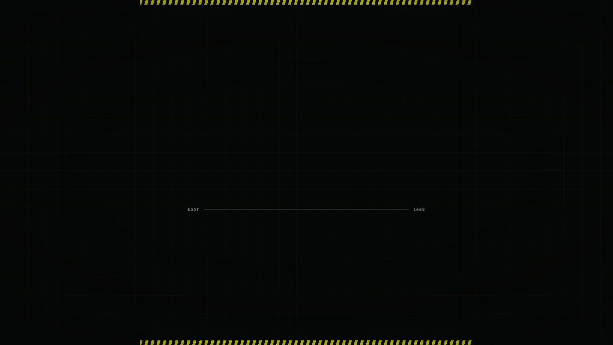
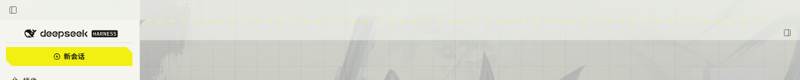

# 设计笔记 / Design notes

记录几处**从代码上看不出动机**的做法。README 只讲这个主题是什么、怎么装、装了什么；
这一页讲为什么这么做、怎么验的。

Notes on the decisions that are not self-evident from the source. The README covers what the
theme is and how to install it; this page covers why it is built the way it is.

---

## 开屏为什么是"注入行"而不是脚本搭的

这是整个主题里最关键的结构决定。原版客户端**没有**独立开屏环节：启动时看到的其实是
**官方 boot 底色（浅色 `#fff` / 深色 `#151517`）加上外壳第一帧**。要让开屏成为首帧，
就必须在"外壳渲染之前"进 DOM。

`@deepseek-ai/dsh-web-frontend/dist/assets/index-*.js` 里那个注入行解释器给出两条事实
（下面是按语义从压缩产物还原的，不是逐字引用）：

```js
// ① 六种行全支持
case "style": { const s = document.createElement("style"); s.textContent = row.text; document.head.append(s); break }
case "html":  (row.placement === "head" ? document.head : document.body)
                .insertAdjacentHTML("beforeend", row.html); break
case "script": /* createElement + textContent + append → 会执行 */ break
// ② 整张表套用在外壳构造之前
const root = document.getElementById("root");
const app  = new ShellController(root);
if (dshDesktopBoot !== undefined) {
  dshDesktopBoot.ready().then(async ({ injections }) => {
    await applyRows(injections, loadScript);   // ← 这里
    /* 之后才开始渲染 */
  });
}
```

所以开屏现在由 `lib/index.js` 发四行：

| 行 | 作用 |
| --- | --- |
| `style`（head） | `html,body{background-color:#050606}` —— 同优先级后置，压掉官方 boot 底色 |
| `html`（body） | `<style>splash.css</style>` + `splash.html` **合成一行**，两者不可能被分开套用（否则一个孤儿 `#ef-splash` 会被当裸文本画出来） |
| `script`（body） | 打 `html[data-ef-splash="on"]` 并 poke 一次 `lang`（见下节）；6 s 兜底撤掉 |
| `script`（body） | 原来的 loader：拉 `theme.js`（非阻塞、`onerror` 吞掉） |

对比实测 —— 同一份服务端 index，一份插入这四行、一份不插，**同一时刻（load 事件后立刻）抓帧**：

| 插入四行 | 不插入 |
| --- | --- |
|  |  |
| 首帧就是开屏（网格 + 上下警戒带 + BOOT 条，字标还没擦写到） | 首帧只有官方 boot 底色，空的 |

`splash.css` 因此必须**自给自足**：自己定义 `--efs-*`、字体栈写死、素材走**根相对路径**
`/dsh-endfield/assets/...`。桌面文档是 `dsh-app://app/`、浏览器是 `http://127.0.0.1:PORT/`，
只有插件这条路由两边都成立 —— `/assets/` 在桌面协议处理器里是特例（直出打包 dist），
所以 `/dsh-endfield/assets/` 这个前缀很关键。它另外自带**兜底**：那条计时动画兼作 5 s 后
整层隐藏，`theme.js` 永远不来也不会挡住界面。

`theme.js` 只负责**时序**：从动画时钟读已经过去多久（注入行可能比脚本早几百毫秒就开播了），
据此排收尾再移除节点。同时保留 fallback —— 页面只拿到脚本没拿到行时（桌面注入表是启动快照），
它会去拉同一份 `splash.css` / `splash.html`，两条路共用一份素材。

---

## 右上角那三个按键

> 本节引用的 `lib/main.js`、`lib/preload-app.cjs` 都是 **DSH 桌面端自己的文件**
> （在安装目录的 `resources/app.asar` 里），不在本仓库内——本仓库的 `lib/` 只有 `index.js`。

它们不是系统标题栏，是本客户端自己的 **Windows Controls Overlay**（`titleBarStyle: "hidden"`
+ `titleBarOverlay`，高 40 px，见 DSH 的 `lib/main.js`），运行时可以改：

```js
ipcMain.on(DESKTOP_IPC.windowsAppearance, (event, language, color, symbolColor) => {
  ...
  mainWindow.setTitleBarOverlay({ color, symbolColor });
});
```

而喂给它的两个颜色，来自 DSH 桌面端 `lib/preload-app.cjs` 里一个隐藏探针：

```js
probe.style.cssText = "position:fixed;visibility:hidden;pointer-events:none;"
  + "background-color:var(--dsw-specific-sidebar-fill);"   // ← 条底色
  + "color:var(--dsw-alias-label-primary)";                // ← 图标色
// 只在 html[lang] 或 body[data-ds-dark-theme] 变动时重新测量并上报
```

也就是说**这排按键的颜色本来就归这套主题管**，开屏期间显得突兀只是因为没有触发重算。
但还有一层：**桌面端顶部那 40 px 压了三层**，而三层必须说同一件事。

| 层 | 是什么 | 谁画的 |
| --- | --- | --- |
| ① | `[data-windows-titlebar] .BynINW_frame:before` —— 整宽一条 `--dsw-specific-sidebar-fill` | 外壳的 layout 插件（`dsh-client-ui-layout`）|
| ② | 页面内容 —— frame 带 `padding-top: var(--dsh-windows-titlebar-height)`，那 40 px 里没有真东西 | 外壳 |
| ③ | 三个按键 + 一层填充色 | Windows Controls Overlay，画在页面**之上** |

问题出在 ③ 叠在 ① 上：两层同一个半透明 token，条子比旁边的侧边栏更稠一档，
于是在 y = 40 处留下一道可见的台阶。而 `setTitleBarOverlay` 只收**一个 CSS 颜色**
（DSH 主进程还有一道 `/^(?:#[\da-f]{3,8}|rgba?\([\d.,%\s]+\))$/` 校验，`linear-gradient(...)`
根本到不了 Electron），渐变给不进去；正确做法是**让它别画**。

```css
/* ③ 停笔：preload 量的是一个挂在 body 上的隐藏探针，只覆盖它自己 */
body > span[style*='visibility:hidden'][style*='--dsw-specific-sidebar-fill'] {
  background-color: transparent !important;
}

/* ① 重切：原来整宽一个色，可它下面坐着两个不同的面 */
[data-windows-titlebar] [data-slot='root'] > div::before {
  background: linear-gradient(90deg,
    var(--dsw-specific-sidebar-fill) 0, var(--dsw-specific-sidebar-fill) var(--ef-col-left, 280px),
    var(--ef-header-fill) var(--ef-col-left, 280px), var(--ef-header-fill) var(--ef-col-right, 100%),
    var(--dsw-alias-bg-layer-1) var(--ef-col-right, 100%)) !important;
}
```

`--ef-col-left` / `--ef-col-right` 由 `theme.js` 在量 HUD 取景框时顺手写进 `<html>`（侧栏收起、
右栏开合都跟着变），于是条带左段 = 侧边栏填充、中段 = 对话区标题栏填充、右段 = 右栏面板填充。
**三层说了同一句话，那道接缝就没有了。**

探针选择器是"只打那一个元素"的：真实表面全部保留自己的 token。它依赖 preload 写进探针
`style` 属性的两个子串——将来 DSH 若改了探针写法，选择器静默失配、退回今天的行为，
`splash.css` 里那条开屏期覆盖是第二道保险。

配套的几处：

- boot 行脚本把 `html.lang` 赋成它自己的值：**同值赋值同样产生 attribute mutation**，
  preload 因此重测并上报，而视觉上什么都没变；开屏收尾时 `theme.js` 撤标记再 poke 一次。
- 顶部警戒带在开屏期回到 `y=0` 跑满整宽，**最后 170 px 用 mask 淡出**，不让黄黑斜纹从黄色图标
  底下穿过；常态它留在 `y=40`（那时条带是外壳画的不透明填充，会盖住它）。
- 开屏期另加一层 `.ef-splash__band`：顶部 40 px 压深一档、向下渐隐到 104 px，给黄色图标一个
  安静的底；只在 `html[data-windows-titlebar]` 下显示。

  实测（用 `Page.addScriptToEvaluateOnNewDocument` 复刻 preload 的探针，读到的就是
  `setTitleBarOverlay` 会收到的东西）：

  | | `color` | `symbolColor` |
  | --- | --- | --- |
  | 开屏期间 | `rgba(0, 0, 0, 0)` 透明 | `rgba(242, 240, 19, 1)` 警戒黄 |
  | 常态 | `rgba(0, 0, 0, 0)` 透明 | `rgba(20, 23, 15, 1)` 正文色 |

  同一时刻读到外壳那条带子的计算值，可以逐段对上：

  ```
  band   = linear-gradient(90deg, rgba(244,246,240,.86) 0…280px,
                                  rgba(248,250,245,.50) 280px…1600px, …)
  侧边栏 = rgba(244, 246, 240, 0.86)        标题栏 = rgba(248, 250, 245, 0.5)
  ```

  

> 一个插件碰不到的边界：窗口本身的 `backgroundColor` 在 Windows 分支没有设置（Electron
> 默认白）。窗口是 `show:false`、加载完才显示，正常看不到它；真遇到"窗口已显示、页面还没画
> 第一笔"，那是主进程的 `BrowserWindow` 选项，属于改 DSH 本身而不是改主题。

---

## 侧边栏与顶栏

四处按具体问题改的布局与行为：

- **品牌行居中** —— deepseek 标识从品牌行左端移到**侧边栏列的中央**，与窗口的最小化/关闭
  处在同一条顶带。做法是把品牌按钮拉出 flex 流（`position: absolute; left: 50%;
  translateX(-50%)`），收起按钮继续占右端——它成为行内唯一在流子元素，外壳本来就右对齐它。
  行高同时从 60 px 收到 40 px：60 px 时标识比窗口按钮低一整条标题栏，40 px 才落进同一条带子。
  实测标识中心与列中心差 **1 px**，与收起按钮仍留 **5 px** 净空。
- **会话标题不再重复** —— 对话区顶栏原来会把侧边栏里的会话名再念一遍
  （`nav[class*='crumbs']`），现在整段隐去；顶栏只留 `标准模式` 胶囊、`对话/轨迹` 页签与右侧工具。
- **收起后回得来** —— 折到 55 px 轨道时，那个"展开"按钮显示的是 **DeepSeek 鲸标**而不是展开箭头，
  看不出能点，于是很容易以为侧边栏没了、只能重启。现在轨道模式
  （`html[data-ef-rail="on"]`，由对话列左边距判定）会把该按钮点亮成警戒黄描边 + 辉光，
  轨道本身也留一道黄色右边线——回来这件事靠的是看得见，而不是记住一个快捷键。
- **移除了侧边栏的 `backdrop-filter`** —— 那是一个全高、宽度每次折叠都在动的元素上挂磨砂，
  正是最容易留下一层卡住的合成层的形状：列宽还在但不再绘制，看上去就是"侧边栏消失了"。
  装饰层同时从 `<body>` 首个子元素改为追加到末尾，避开任何 `body > :first-child` 假设。
