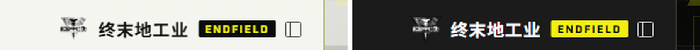

# dsh-endfield-theme · 《明日方舟：终末地》主题

为 **DeepSeek Harness Web GUI** 做的一套终末地主题：炭黑工业 HUD + 警戒黄强调色，
带**开屏动画**与**对话区背景**。它是一个普通的 DSH 客户端插件（host 半区发路由 +
注入一行脚本，浏览器半区是纯 CSS/JS），不依赖皮肤中心，也不需要构建步骤。

English: an Arknights: Endfield themed client plugin for the DeepSeek Harness Web
GUI — charcoal industrial HUD, a single hazard-yellow accent, a boot splash and a
conversation backdrop. Host half serves assets and injects one script; browser half
is plain CSS/JS. No build step, no skin center required.


| 深色（完全体） | 浅色（雪原 daylight） |
| --- | --- |
|  |  |

## 它做了什么

- **开屏动画** —— 每次文档加载跑一次，约 2.9 s，用的是**官方字标素材**（不是排出来的字）：
  黑色底 + 44 px 测量网格 + 上下警戒带拉开 → 一枚巨大的终末地三角徽记以 5.5% 白浮出来做底
  → 一道警戒黄扫描光带从上扫到下 → **`终末地` 中文字标被一道带亮边的横向擦除从左往右写出来**
  → 细线、`BOOT 100%` 进度条、左下角三行终端自检、右下角英文 `ENDFIELD INDUSTRIES` 小字标
  → 整屏像 CRT 一样纵向收拢消失。随时点击/按键即跳过；`prefers-reduced-motion` 下完全不播。

  

  （0.4 / 0.9 / 1.5 / 2.1 s 四帧。字标用的是 `endfield-mark-zh.png`（白，中英合一）
  与 `endfield-mark-en.png`（白，纯英文）；大徽记只取上半段的山川纹理冠部做底纹——
  整张徽记中间还压着同一句 `终末地 / ENDFIELD INDUSTRIES`，拿它做底纹会在字标被擦写出来的
  同一时刻、同一位置印出一个鬼影。素材里对应的黑色版本也处理成
  `endfield-mark-zh-dark.png`，浅底场景用得上。）

  它现在是**首帧**而不是脚本搭出来的：原版客户端没有独立开屏环节，启动时看到的其实是官方
  boot 底色（浅色 `#fff` / 深色 `#151517`）加外壳第一帧，所以开屏改由 **index 注入行**下发。
  细节见下面「开屏为什么是注入行」与「右上角那三个按键」两节。
- **对话区背景** —— 背景艺术是一张**烤过的主视觉**：深色模式用炭黑版（亮度 ×0.30、去饱和、
  加暗角），浅色模式用雪原版。它被放在 `#ef-backdrop`（`z-index:-1` 的固定层）里，
  由 CSS 把外壳自己的白底/面板底改成透明 —— 于是画面成为"地面"，而不是白房间里挂的一张画。
  对话里有消息时（`html[data-ef-conversation="on"]`，由 MutationObserver 判定）画面自动退一档，
  正文另加一层极淡的文字光晕，保证可读性。
- **HUD 取景框** —— 四角括线 + 右缘刻度**锚在对话列上**，不是锚在窗口上：窗口级括线会正好
  压在侧边栏品牌行上，看起来像第二个画歪了的"收起侧栏"按钮叠在 logo 上。现在由
  `theme.js` 量 `[class*="centerCol"]` 的矩形写进 `.ef-frame`，`ResizeObserver` + 窗口 resize +
  MutationObserver 三路跟随，侧栏收起/展开都会重新贴合。
- **整体色调** —— 全部 `--dsw-*` 设计 token 重映射成终末地那套语言：炭黑面板、1 px 发丝结构线、
  近直角（半径 2–10 px）、等宽读数、警戒黄**只给状态**（新会话按钮、当前行左轨、链接、
  选中文本、焦点环、进度）。深色是设计本体，浅色是「雪原」变体。

## 开屏为什么是"注入行"而不是脚本搭的

这是这一版最重要的结构决定。原版客户端**没有**独立开屏环节：启动时看到的其实是
**官方 boot 底色（浅色 `#fff` / 深色 `#151517`）加上外壳第一帧**。要让开屏成为首帧，
就必须在"外壳渲染之前"进 DOM。

`@deepseek-ai/dsh-web-frontend/dist/assets/index-*.js` 里那个注入行解释器给出两条事实：

```js
// ① 六种行全支持
case "style": { const s = document.createElement("style"); s.textContent = row.text; document.head.append(s); break }
case "html":  (row.placement === "head" ? document.head : document.body)
                .insertAdjacentHTML("beforeend", row.html); break
case "script": /* createElement + textContent + append → 会执行 */ break
// ② 整张表套用在外壳构造之前
const root = document.getElementById("root");
const app  = new ShellController(root);
if (dshDesktopBoot !== undefined) {
  dshDesktopBoot.ready().then(async ({ injections }) => {
    await applyRows(injections, loadScript);   // ← 这里
    /* 之后才开始渲染 */
  });
}
```

所以开屏现在由 `lib/index.js` 发四行：

| 行 | 作用 |
| --- | --- |
| `style`（head） | `html,body{background-color:#050606}` —— 同优先级后置，压掉官方 boot 底色 |
| `html`（body） | `<style>splash.css</style>` + `splash.html` **合成一行**，两者不可能被分开套用（否则一个孤儿 `#ef-splash` 会被当裸文本画出来） |
| `script`（body） | 打 `html[data-ef-splash="on"]` 并 poke 一次 `lang`（见下节）；6 s 兜底撤掉 |
| `script`（body） | 原来的 loader：拉 `theme.js`（非阻塞、`onerror` 吞掉） |

对比实测 —— 同一份服务端 index，一份插入这四行、一份不插，**同一时刻（load 事件后立刻）抓帧**：

| 插入四行 | 不插入 |
| --- | --- |
|  |  |
| 首帧就是开屏（网格 + 上下警戒带 + BOOT 条，字标还没擦写到） | 首帧只有官方 boot 底色，空的 |

`splash.css` 因此必须**自给自足**：自己定义 `--efs-*`、字体栈写死、素材走**根相对路径**
`/dsh-endfield/assets/...`。桌面文档是 `dsh-app://app/`、浏览器是 `http://127.0.0.1:PORT/`，
只有插件这条路由两边都成立 —— `/assets/` 在桌面协议处理器里是特例（直出打包 dist），
所以 `/dsh-endfield/assets/` 这个前缀很关键。它另外自带**兜底**：那条计时动画兼作 5 s 后
整层隐藏，`theme.js` 永远不来也不会挡住界面。

`theme.js` 只负责**时序**：从动画时钟读已经过去多久（注入行可能比脚本早几百毫秒就开播了），
据此排收尾再移除节点。同时保留 fallback —— 页面只拿到脚本没拿到行时（桌面注入表是启动快照），
它会去拉同一份 `splash.css` / `splash.html`，两条路共用一份素材。

## 右上角那三个按键

它们不是系统标题栏，是本客户端自己的 **Windows Controls Overlay**（`titleBarStyle: "hidden"`
+ `titleBarOverlay`，高 40 px，见 `lib/main.js`），运行时可以改：

```js
ipcMain.on(DESKTOP_IPC.windowsAppearance, (event, language, color, symbolColor) => {
  ...
  mainWindow.setTitleBarOverlay({ color, symbolColor });
});
```

而喂给它的两个颜色，来自 `lib/preload-app.cjs` 里一个隐藏探针：

```js
probe.style.cssText = "position:fixed;visibility:hidden;pointer-events:none;"
  + "background-color:var(--dsw-specific-sidebar-fill);"   // ← 条底色
  + "color:var(--dsw-alias-label-primary)";                // ← 图标色
// 只在 html[lang] 或 body[data-ds-dark-theme] 变动时重新测量并上报
```

也就是说**这排按键的颜色本来就归这套主题管**——开屏期间之所以突兀，只是没人通知它重算。
但底下还藏着一层更麻烦的事：**桌面端顶部那 40 px 其实压了三层**，而它们必须说同一件事。

| 层 | 是什么 | 谁画的 |
| --- | --- | --- |
| ① | `[data-windows-titlebar] .BynINW_frame:before` —— 整宽一条 `--dsw-specific-sidebar-fill` | 外壳的 layout 插件（`dsh-client-ui-layout`）|
| ② | 页面内容 —— frame 带 `padding-top: var(--dsh-windows-titlebar-height)`，那 40 px 里没有真东西 | 外壳 |
| ③ | 三个按键 + 一层填充色 | Windows Controls Overlay，画在页面**之上** |

问题就出在 ③ 叠在 ① 上：两层同一个半透明 token，条子比旁边的侧边栏更稠一档——开屏一结束，
y = 40 那道台阶就是你说的"非常明显的区别"。而 `setTitleBarOverlay` 只收**一个 CSS 颜色**
（DSH 主进程还有一道 `/^(?:#[\da-f]{3,8}|rgba?\([\d.,%\s]+\))$/` 校验，`linear-gradient(...)`
根本到不了 Electron），渐变给不进去；正确做法是**让它别画**。

```css
/* ③ 停笔：preload 量的是一个挂在 body 上的隐藏探针，只覆盖它自己 */
body > span[style*='visibility:hidden'][style*='--dsw-specific-sidebar-fill'] {
  background-color: transparent !important;
}

/* ① 重切：原来整宽一个色，可它下面坐着两个不同的面 */
[data-windows-titlebar] [data-slot='root'] > div::before {
  background: linear-gradient(90deg,
    var(--dsw-specific-sidebar-fill) 0, var(--dsw-specific-sidebar-fill) var(--ef-col-left, 280px),
    var(--ef-header-fill) var(--ef-col-left, 280px), var(--ef-header-fill) var(--ef-col-right, 100%),
    var(--dsw-alias-bg-layer-1) var(--ef-col-right, 100%)) !important;
}
```

`--ef-col-left` / `--ef-col-right` 由 `theme.js` 在量 HUD 取景框时顺手写进 `<html>`（侧栏收起、
右栏开合都跟着变），于是条带左段 = 侧边栏填充、中段 = 对话区标题栏填充、右段 = 右栏面板填充。
**三层说了同一句话，那道接缝就没有了。**

探针选择器是"只打那一个元素"的：真实表面全部保留自己的 token。它依赖 preload 写进探针
`style` 属性的两个子串——将来 DSH 若改了探针写法，选择器静默失配、退回今天的行为，
`splash.css` 里那条开屏期覆盖是第二道保险。

配套的几处：

- boot 行脚本把 `html.lang` 赋成它自己的值：**同值赋值同样产生 attribute mutation**，
  preload 因此重测并上报，而视觉上什么都没变；开屏收尾时 `theme.js` 撤标记再 poke 一次。
- 顶部警戒带在开屏期回到 `y=0` 跑满整宽，**最后 170 px 用 mask 淡出**，不让黄黑斜纹从黄色图标
  底下穿过；常态它留在 `y=40`（那时条带是外壳画的不透明填充，会盖住它）。
- 开屏期另加一层 `.ef-splash__band`：顶部 40 px 压深一档、向下渐隐到 104 px，给黄色图标一个
  安静的底；只在 `html[data-windows-titlebar]` 下显示。

  实测（用 `Page.addScriptToEvaluateOnNewDocument` 复刻 preload 的探针，读到的就是
  `setTitleBarOverlay` 会收到的东西）：

  | | `color` | `symbolColor` |
  | --- | --- | --- |
  | 开屏期间 | `rgba(0, 0, 0, 0)` 透明 | `rgba(242, 240, 19, 1)` 警戒黄 |
  | 常态 | `rgba(0, 0, 0, 0)` 透明 ← 这次的改动 | `rgba(20, 23, 15, 1)` 正文色 |

  同一时刻读到外壳那条带子的计算值，可以逐段对上：

  ```
  band   = linear-gradient(90deg, rgba(244,246,240,.86) 0…280px,
                                  rgba(248,250,245,.50) 280px…1600px, …)
  侧边栏 = rgba(244, 246, 240, 0.86)        标题栏 = rgba(248, 250, 245, 0.5)
  ```

  

> 一个插件碰不到的边界：窗口本身的 `backgroundColor` 在 Windows 分支没有设置（Electron
> 默认白）。窗口是 `show:false`、加载完才显示，正常看不到它；真遇到"窗口已显示、页面还没画
> 第一笔"，那是主进程的 `BrowserWindow` 选项，属于改 DSH 本身而不是改主题。

## 侧边栏与顶栏

四处按使用反馈改的布局与行为：

- **品牌行居中** —— deepseek 标识从品牌行左端移到**侧边栏列的中央**，与窗口的最小化/关闭
  处在同一条顶带。做法是把品牌按钮拉出 flex 流（`position: absolute; left: 50%;
  translateX(-50%)`），收起按钮继续占右端——它成为行内唯一在流子元素，外壳本来就右对齐它。
  行高同时从 60 px 收到 40 px：60 px 时标识比窗口按钮低一整条标题栏，40 px 才落进同一条带子。
  实测标识中心与列中心差 **1 px**，与收起按钮仍留 **5 px** 净空。
- **会话标题不再重复** —— 对话区顶栏原来会把侧边栏里的会话名再念一遍
  （`nav[class*='crumbs']`），现在整段隐去；顶栏只留 `标准模式` 胶囊、`对话/轨迹` 页签与右侧工具。
- **收起后回得来** —— 折到 55 px 轨道时，那个"展开"按钮显示的是 **DeepSeek 鲸标**而不是展开箭头，
  看不出能点，于是很容易以为侧边栏没了、只能重启。现在轨道模式
  （`html[data-ef-rail="on"]`，由对话列左边距判定）会把该按钮点亮成警戒黄描边 + 辉光，
  轨道本身也留一道黄色右边线；快捷键 **Ctrl+Alt+B** 任何时候都能切换。
- **移除了侧边栏的 `backdrop-filter`** —— 那是一个全高、宽度每次折叠都在动的元素上挂磨砂，
  正是最容易留下一层卡住的合成层的形状：列宽还在但不再绘制，看上去就是"侧边栏消失了"。
  whale-fantasy 皮肤得出过同样结论并在 README 里量过。装饰层同时从 `<body>` 首个子元素改为
  追加到末尾，避开任何 `body > :first-child` 假设。

## 品牌位换成了终末地工业

| 浅色模式（雪原侧栏） | 深色模式（炭黑侧栏） |
| --- | --- |
|  | |

**这是个纯个人化改动，先说清楚**：侧边栏左上那个位置原本是 DeepSeek Harness 的产品标识
（鲸标 + `deepseek` + `HARNESS` 徽章）。换掉之后，客户端在界面里就不再自称 DSH 了——
窗口标题、对话框、插件页里的产品名都还是 DSH，只有这一处变了。自己用没问题，
要分发给别人就得自己判断商标这件事。

做法：

- 图标就是**官方 lockup 原图**（冠部 + `终末地 / ENDFIELD INDUSTRIES` + 倒三角），
  没有重画、没有描摹，只是缩到 28px。这个尺寸下里面的字标读不出来，也不指望读出来——
  它承担的是"剪影"，名字由旁边的「终末地工业」写清楚。
- **必须出两份素材，而且很容易搞反**。原图是双色的：不透明像素里 49% 纯黑、46% 纯白，
  而**白色那半才是主角**——冠部的等高线、`终末地` 字标、`ENDFIELD INDUSTRIES` 那条细线
  全是白颜料。所以**原图是给深色底画的**：

  | 侧栏 | 用哪份 | 做法 |
  | --- | --- | --- |
  | 深色（炭黑） | `endfield-lockup-dark-bg.png` | 原图原样 |
  | 浅色（雪原） | `endfield-lockup-light-bg.png` | 黑白对调，镂空保持镂空 |

  搞反了**不会报错、也不会崩**：图形照样渲染、轮廓照样看得见，只有字标悄悄沉进背景里——
  得专门去量才算得出来。`tools/check_brand_lockup.py`（在作者工作区，不随仓库分发）
  就是干这个的：取字标那一段，数深色与浅色像素，要求浅底那份是深字、深底那份是浅字。
- 文案是「终末地工业」+ 一枚 `ENDFIELD` 徽章，位置与原来 `deepseek` + `HARNESS` 一一对应；
  徽章浅色下是炭黑底黄字、深色下反过来。
- 原标识是 **React 拥有的节点**，所以是**隐藏**（`html[data-ef-brand='on']` 下的两条
  `display: none`）而不是删除，替换节点追加在旁边。万一某次重渲染把它冲掉，
  `start()` 里的 rAF 泵与那个 subtree observer 会补回来——`data-ef-brand` 闸门保证幂等，
  不会和 React 打乒乓。
- 按钮自己的 `aria-label`（新建会话）没动，整个标识区本来就是 `aria-hidden`，
  所以这个改动不影响这个按钮"是什么、干什么"。
- 想临时看回原样：`http://127.0.0.1:19387/?dsh-endfield-brand=0`

## 字体

客户端全局换成两套**随插件发布的可变字体**（都做了子集化，SIL OFL 1.1，许可证在
`client/assets/fonts/`）：

| 字体 | 来源 | 子集 | 用途 |
| --- | --- | --- | --- |
| **Endfield Sans SC** | Noto Sans SC（可变，wght 100–900） | 拉丁 + GB2312（7626 字）+ CJK 标点，1.95 MB | 全局 UI：正文、按钮、会话名、对话框 |
| **Endfield Tech** | Saira（可变，wdth + wght） | 拉丁/数字/标点，105 KB | HUD 读数、大写标签、标题、模型名一类"仪器字" |

为什么是这两套：终末地工业的味道来自**方正的重黑**加**窄体技术字**——中文用 800/900 的思源黑
配紧字距，英文数字走 Saira 的窄体轴。原来的 `--dsw-font-family` 会把中文交给系统里碰巧装了的
微软雅黑，那是这套主题最"不像"的一环。

两处细节值得记下来：`--ef-din` 的栈尾**必须**接 `var(--ef-sans)`——Saira 一个汉字都没有，
落到 `sans-serif` 就会退回微软雅黑，所有显示体里的中文标签会当场破功。以及字体 URL 全部写在
`theme.css` 里（不写在 JS 里），这样整张表可搬迁、可离线注入测试。

## 配色来源

不是另配的，是从发行主视觉里量出来的（工作区里的 `tools/bake_assets.py`，Pillow 采样；
背景图也由同一个脚本烘出来）：

| 角色 | 色值 | 来源 |
| --- | --- | --- |
| 警戒黄 | `#F2F013` | 海报最亮的饱和色，实测 `#F9F60C`，压暗一档以适配炭黑 |
| 面板高亮 | `#FBFA6A` | 同色提亮，用于 hover |
| 炭黑 1000 | `#050606` | 画面四周最深的水 |
| 炭黑 900–500 | `#0A0C0C` → `#2E3331` | 暗部层次的 `#242820` / `#383E36` 连成阶梯 |
| 正文 | `#EDF0EA` | 银白，微暖以免和警戒黄打架 |
| 次要 / 三级 / 注脚 | `#A6AEA8` / `#79827C` / `#5D6661` | 画面里的灰阶 |

浅色模式把品牌色换成炭黑（浅底上按钮用墨黑 + 白字），警戒黄降为 `#6B6A00` 一类的强调色 ——
白底上直接铺 `#F2F013` 是读不了的。

## 安装

```sh
dsh plugin --profile desktop add github:760403-create/dsh-endfield-theme
dsh plugin --profile desktop remove dsh-endfield-theme     # 卸载
```

本地改代码时用 link 装，改 `client/` 下的文件刷新页面即生效：

```sh
dsh plugin --profile desktop add link:<本仓库绝对路径>
```

**哪一半改动需要重启**：`client/` 下的文件按请求读盘，改完刷新即可；`lib/index.js` 是宿主
半区，**桌面端的注入表在宿主启动时采集一次**——所以改注入行要重启一次客户端，
浏览器形态则是下一次请求就重新采集。

## 文件

```
dsh-endfield-theme/
├─ package.json                 dsh.bundle.patch 指向下面的 patch
├─ cordis.patch.yml             一条 insert 行
├─ lib/index.js                 host 半区：prefix 路由 + 四条 index 注入行 + tapIndex
├─ client/
│  ├─ splash.css                开屏：自给自足的首帧样式表（+ 兜底自动隐藏 + 按键配色覆盖）
│  ├─ splash.html               开屏 DOM（与 splash.css 合成一条 html 注入行）
│  ├─ theme.css                 @font-face + L1 token 重映射 + L2 外壳面重切 + HUD 取景框
│  ├─ theme.js                  浏览器半区：样式表、背景层、取景框、开屏时序、状态标记
│  └─ assets/
│     ├─ endfield-field.jpg         深色背景（1920×1080，烘过的主视觉）
│     ├─ endfield-field-day.jpg     浅色背景
│     ├─ endfield-mark-zh.png       终末地 + ENDFIELD INDUSTRIES 字标（白，15 KB）
│     ├─ endfield-mark-zh-dark.png  同一枚字标的墨黑版（浅底用，19 KB）
│     ├─ endfield-mark-en.png       纯英文 ENDFIELD INDUSTRIES 字标（白，14 KB）
│     ├─ endfield-emblem.png        徽记冠部白线稿，开屏底纹（13 KB）
│     ├─ endfield-icon.svg          站点图标
│     └─ fonts/
│        ├─ endfield-sans-sc.woff2  Noto Sans SC 子集（1.95 MB）
│        ├─ endfield-tech.woff2     Saira 子集（105 KB）
│        └─ OFL-*.txt               两份 SIL OFL 1.1 许可证
└─ preview/                     dark / light / splash / splash-strip / firstpaint-*
```

路由只有一条：`/dsh-endfield/*`（`theme.css`、`theme.js`、`splash.css`、`splash.html`、`assets/*`）。
它只接受同源 GET/HEAD，路径逃逸 fail-closed，文件按 mtime 缓存（改完刷新即生效）。

## 开关与调试

- 临时不播开屏：`http://127.0.0.1:19387/?dsh-endfield-splash=0`
- 临时看回原品牌：`http://127.0.0.1:19387/?dsh-endfield-brand=0`
- 控制台重播开屏：`__dshEndfieldTheme.replay()`
- 侧边栏收起/展开：点轨道里那枚点亮的鲸标按钮，或 **Ctrl+Alt+B**
- 系统「减少动态效果」开启时：不播开屏，背景动效全部关掉，主题照常生效
- 想要完全体：设置 → 通用 → 外观 切到**深色**（浅色是雪原变体，深色才是终末地的语言）

**哪一半改动需要重启**：`client/` 下的文件按请求读盘，改完刷新即可；
`lib/index.js` 是宿主半区，桌面端的注入表在宿主启动时采集一次 —— 所以**改注入行要重启客户端**，
浏览器形态则是下一次请求就重新采集。

## 怎么验的

主题不是"看着差不多"就交的。仓库里带一份 host 半区的测试，不需要跑起整个 harness：

```sh
npm test        # = node test/host.test.mjs
```

`test/host.test.mjs` 把一个假的 cordis root 喂给插件，然后断言注入行的种类、顺序与内容，
路由的 content-type、目录重定向、HEAD、405/403/404、路径逃逸 fail-closed，以及 tap 幂等与卸载。

其余验证是在作者的工作区里跑的一次性链路（不进仓库，因为都依赖本机的 profile 与凭据）：

| 工具 | 作用 |
| --- | --- |
| `bake_assets.py` | 采样主视觉调色板 + 烘背景图（与本文表格同源） |
| `prepare_logos.py` | 把字标素材抠成白/黑两套透明 PNG 并裁掉透明边 |
| `subset_fonts.py` | 按 GB2312 + 拉丁子集化两套可变字体并转 woff2 |
| `dsh-cookie.mjs` | 用 profile 里的签名密钥签出 web 会话 cookie，好让无头浏览器能打开真实 GUI |
| `cdp.mjs` | 无头 Edge + CDP：打开真实 GUI、注入脚本、按时间轴冻结动画、截图、读计算结果 |
| `firstpaint-ab.mjs` | 拿服务端真实 index 生成"插行 / 不插行"两份文档，同一时刻抓帧对比首帧 |

`preview/` 的图都是**从真实 GUI 里拍的**：`splash*.jpg` 是插件真身注入后按时间轴冻结抓的帧
（`__dshEndfieldTheme.replay()` + Web Animations `currentTime` 擦洗，所以每帧可复现而不是碰运气），
`dark.jpg` / `light.jpg` 是同一个 1920×1010 窗口切深浅两套配色后的空对话页。
`firstpaint-with.png` / `firstpaint-without.png` 是首帧 A/B：同一份服务端 HTML，
一份插入注入行、一份不插，在 load 事件后立刻抓帧。

## 授权

代码 MIT（[`LICENSE`](LICENSE)）。**但仓库里带的素材不全是我的**，详见 [`NOTICE.md`](NOTICE.md)：

- 字体：**Noto Sans SC** 与 **Saira**，均为 SIL OFL 1.1，子集化后随插件分发，许可证全文在
  `client/assets/fonts/`。
- 终末地美术素材（标志、锁标、背景）由作者取自 **B 站用户
  [SealedManx41527](https://space.bilibili.com/2056642352)** 发布的
  [这篇图文](https://www.bilibili.com/opus/1237489243187576841)，他自己那一份也来自
  《明日方舟：终末地》官方素材。**版权与商标始终属于 © Hypergryph / GRYPHLINE**，
  按**同人非商业**用途分发，**不在 MIT 范围内**；商用请自行替换
  `client/assets/endfield-lockup-*.png`、`endfield-mark-*.png` 与 `endfield-field*.jpg`。
- 本插件是 DSH 的第三方插件，不是 DeepSeek 官方项目。
