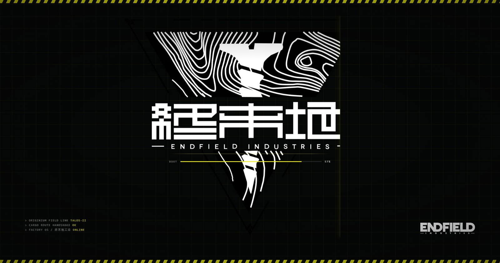
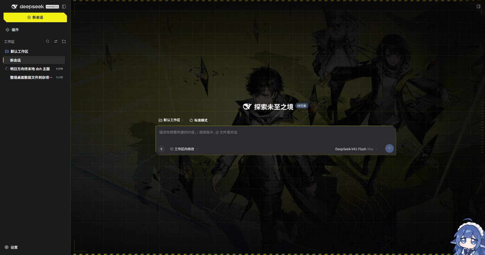
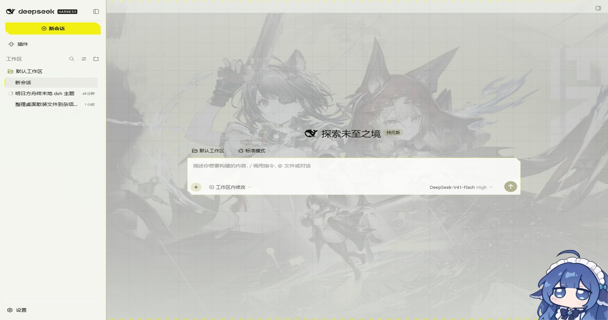
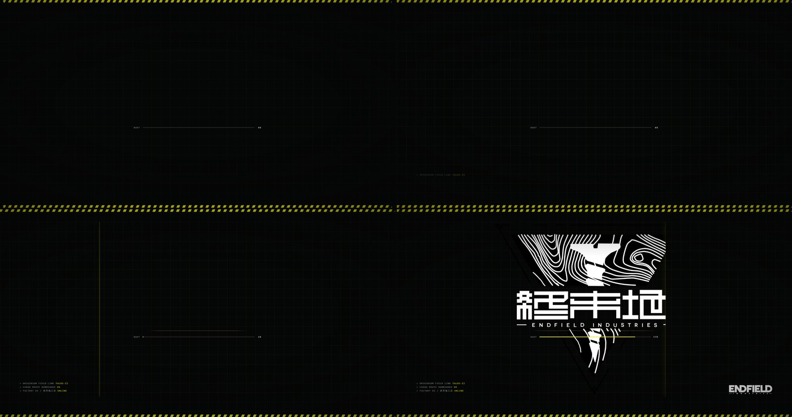
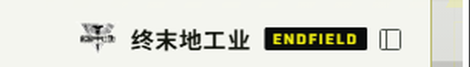

# dsh-endfield-theme · 《明日方舟：终末地》主题

[](https://www.npmjs.com/package/dsh-endfield-theme)
[](LICENSE)

为 **DeepSeek Harness Web GUI** 做的一套终末地主题：炭黑工业 HUD + 警戒黄强调色，
带**开屏动画**与**对话区背景**。它是一个普通的 DSH 客户端插件（host 半区发一条路由 +
四条 index 注入行，浏览器半区是纯 CSS/JS），不依赖皮肤中心，也不需要构建步骤。

桌面端与浏览器端渲染的是同一份前端，主题两边都生效。差别只在桌面端**多一层窗口装饰**：
Windows Controls Overlay 那 40 px、以及由 preload 打上的 `data-windows-titlebar` 标记。

**验证覆盖并不对称**，这点直说，免得读者按同一份信任去读两件事：

| 形态 | 验证到什么程度 |
| --- | --- |
| **浏览器**（`http://127.0.0.1:PORT/`） | `preview/` 里**每一张图**都是无头 Edge 打在这个真实地址上拍的。注入行与开屏首帧、背景层、HUD 取景框、品牌位、标题栏条带，全部在这条路径上量过 |
| **桌面端**（Electron 窗口） | 注入行、WCO 那 40 px、caption 按钮的取色，来自**读 DSH 源码 + 在浏览器里复刻 preload 的标记**，并在真实窗口里核对过。**有一处已知差别**：桌面端在开屏出现之前，会有几帧应用自己的 boot 卡可见 |

**"首帧即开屏"只在浏览器形态成立。** 浏览器那条路径把注入行**直接渲染进返回的 HTML**，
所以它们必然早于任何脚本；桌面端的 `index.html` 是包装 dist 里一个 825 字节的静态文件，
由 `dsh-app://` 直出、不经过 web 服务器，注入行要等 `dshDesktopBoot.ready()` 的一次 IPC
往返之后才落地——那时 boot 卡已经画完了。

这个缺口**插件补不上**，原因和取舍写在 [`NOTES.md`](NOTES.md)：
前端的行解释器里 `script-preload` 是空实现、`preload-app.cjs` 也不认识它，所以不存在
"首帧之前"的通道；窗口的 `backgroundColor` 与 `show:false` 时机属于主进程。
注入行在桌面端的价值是"**在插件能触及的最早时刻**把 boot 卡换成开屏"，不是消除闪烁。

English: an Arknights: Endfield themed client plugin for the DeepSeek Harness Web
GUI — charcoal industrial HUD, a single hazard-yellow accent, a boot splash and a
conversation backdrop. The host half serves one asset route and four
index-injection rows; the browser half is plain CSS/JS. No build step, no skin
center required.

The desktop app and the browser render the same front end, so the theme applies to
both; the desktop only adds window chrome (the 40px Windows Controls Overlay and
the `data-windows-titlebar` marker the preload sets). Verification is lopsided and
worth stating: every image under `preview/` was captured in headless Edge against
the served web address, while the desktop-only behaviour was reasoned from DSH's
source and by reproducing the preload's markers in the browser, not by attaching to
the Electron renderer.



| 深色（推荐） | 浅色（雪原 daylight） |
| --- | --- |
|  |  |

## 它做了什么

- **开屏动画** —— 每次文档加载跑一次，约 2.9 s，用的是终末地字标素材（不是排出来的字，
  出处见 [`NOTICE.md`](NOTICE.md)）：
  黑色底 + 46 px 测量网格 + 上下警戒带拉开 → **原始徽记整张图（冠部 + `终末地` +
  `ENDFIELD INDUSTRIES` + 倒三角，未做任何处理）被一道带亮边的横向擦除从左往右写出来，
  写出的进度与下面的读条同步** → 细线、`BOOT` 读数条、左下角三行终端自检、右下角英文
  小字标 → 整屏像 CRT 一样纵向收拢消失。
  同时播放一条开屏音效（`endfield-boot.mp3`，约 2.9 s 后淡出）。随时点击/按键即跳过；
  `prefers-reduced-motion` 下完全不播。

  

  （0.4 / 0.9 / 1.5 / 2.1 s 四帧。底纹用的是**原始徽记本身**——中间那句 `终末地` 就是图里的字，
  不是另外画上去的一层，所以擦除揭示的就是它，也就不存在"底纹与字标重影"的问题。
  进度条上的百分比由 `theme.js` 从**同一个时钟动画**算出，因此数字与填充永远一致；擦除与
  读条共用同一条时间窗（1.45 s → 2.6 s），**读条走到哪里，字就写到哪里**。）

  **动画只用合成层属性**：`transform` / `opacity`（以及擦除用的 `clip-path`）。上一版那条
  从上而下的扫描光带动画的是 `top`，**每帧触发重排**，是当时不流畅的主因，已移除；亮边那道线
  原本也动画 `left`，同样改成 `translateX`。

  **音效只在桌面客户端响**：Electron 的 `autoplayPolicy` 默认是
  `no-user-gesture-required`，而浏览器要求用户先有交互——被拒时脚本静默继续，
  开屏照常播完，不报错也不中断。

  它现在是**首帧**而不是脚本搭出来的：原版客户端没有独立开屏环节，启动时看到的其实是官方
  boot 底色（浅色 `#fff` / 深色 `#151517`）加外壳第一帧，所以开屏改由 **index 注入行**下发。
  细节见下面「开屏为什么是注入行」与「右上角那三个按键」两节。
- **对话区背景** —— 背景艺术是一张**烤过的主视觉**：深色模式用炭黑版（亮度 ×0.30、去饱和、
  加暗角），浅色模式用雪原版。它被放在 `#ef-backdrop`（`z-index:-1` 的固定层）里，
  由 CSS 把外壳自己的白底/面板底改成透明 —— 于是画面成为"地面"，而不是白房间里挂的一张画。
  对话里有消息时（`html[data-ef-conversation="on"]`，由 MutationObserver 判定）画面自动退一档，
  正文另加一层极淡的文字光晕，保证可读性。
- **HUD 取景框** —— 四角括线 + 右缘刻度**锚在对话列上**，不是锚在窗口上：窗口级括线会正好
  压在侧边栏品牌行上，看起来像第二个画歪了的"收起侧栏"按钮叠在 logo 上。现在由
  `theme.js` 量 `[class*="centerCol"]` 的矩形写进 `.ef-frame`，`ResizeObserver` + 窗口 resize +
  MutationObserver 三路跟随，侧栏收起/展开都会重新贴合。
- **整体色调** —— `--dsw-*` 设计 token 重映射成终末地那套语言：炭黑面板、1 px 发丝结构线、
  近直角（半径 2–10 px）、等宽读数、警戒黄**只给状态**（新会话按钮、当前行左轨、链接、
  选中文本、焦点环、进度）。深色是设计本体，浅色是「雪原」变体。

- **屏幕细纹** —— 一层 `repeating-linear-gradient`（1 px 亮、2 px 暗，约 5% 平均压暗），
  **纯静态、零动画**，所以不占每帧预算。它是**唯一一层画在应用之上**的图层（`#ef-crt`，
  `z-index` 略低于开屏的 2147483000）——扫线如果被面板盖住，那是墙纸不是屏幕。开屏自己也
  有一层（稍重一点，因为开屏是亮场）。`pointer-events: none` 是硬要求：它铺满整个视口，
  否则整个应用都点不动。浅色模式减半。想关掉加 `?dsh-endfield-crt=0`。

- **轮次索引** —— 对话列左侧每个消息项一个小的警戒黄轮次号。**纯 CSS**：聊天流每一项本来
  就带 `data-chat-turn`，所以序号由 `attr()` 取得，不需要脚本遍历，流式输出时也没有东西需要
  同步。序号**在条目内部**（靠 `padding-left: 20px` 留位），不是负偏移——实测消息左缘就在
  栏目边界（280 px 处，侧栏 277 px），负偏移会把序号推进侧栏。只作用于非 `turn-process`
  项，因为那类项嵌在别的项里，双重缩进会叠加。

- **电力储备（余额可视化）** —— 侧栏底部把**账户余额**画成一块电量计：刻度格 + `¥` 数字 +
  状态词（`NOMINAL` / `OUTPUT LOW` / `DEPLETED`），满量程 = **预警阈值 ×4**，所以预警点落在 1/4 处。
  做成电量计是因为你提供的两句警告音是**电站播报** —— 余额恰好是这套语言里最贴切的东西：
  一份会耗尽、会告警、会断电的储备。

  数值来自宿主半区的 `GET /dsh-endfield/balance`，而宿主**只是问 DSH 自己的账号服务**
  （`deepseekAccount` 服务，方法 `getBalance(client)`）：**插件从不接触凭证、也不直连 Platform**。
  宿主对返回值**不做结构假设**，直接透传给浏览器；浏览器只读它认得的字段，认不出就显示
  `NO SIGNAL` 而不是猜一个数字。缓存 30 秒，免得开着的面板每分钟打一次账号接口。

  账号服务是**可选依赖**，所以它和 `webServer` 放在**两个独立的 inject** 里：放进同一个的话，
  在没有账号 provider 的 profile 上 inject 永不触发，**整个主题都不会注册**。

  余额低于阈值播 `endfield-low-power.mp3`，小于等于 0 播 `endfield-no-power.mp3` —— **边沿触发**，
  不是电平触发：每分钟轮询一次，电平触发会每分钟播一遍。余额回升后重置，下次再跌会再报。

- **设置页** —— 设置对话框里多一个「终末地主题」分页，13 项设置，存在 `localStorage`，
  改完即时生效（开屏 / 品牌位 / 开屏音效下次刷新生效）。

  这个插件是 **host-only**（`cordis.patch.yml` 里没有 `dsh.client` facet），注册不了官方设置页，
  所以它**扩展设置对话框自己的 DOM**。两个锚点都取自实测而不是猜类名：导航项取 `nav button`
  的最后一个（结构定位，因为标签栏没有 `data-slot`），内容区取
  **`[data-slot="settings.section"]` 的父节点** —— `data-slot` 是外壳有意设置的稳定属性，
  周围那圈 `wCInkW_*` 是构建哈希，不能依赖。分页切换由主题自己处理：外壳不知道一个它没渲染过的
  标签存在，所以点我们的标签就藏起它的内容，点它的标签就藏起我们的。

  **面板插在那个父节点「里面」、紧挨着被替换的 section 之后** —— 因为实测那正是**滚动容器**
  （`overflow-y: auto`，从面板到对话框之间唯一可滚的一层）。第一版把它插在容器**外面**，
  于是多出来的设置项挂在折线以下、**没有任何东西能滚到它们**。同理，切换时藏的是
  **那一节 section 本身**，不是容器 —— 藏容器会把我们自己的页面一起藏掉。

  标签的**盒子样式直接复用外壳自己的 nav-cell 类名**（运行时复制），只额外加一条警戒黄左轨 ——
  这样尺寸、内边距、悬停行为都跟着外壳走，不会因为外壳改了样式而错位。

  开关是**真的 checkbox**（`appearance: none` 重绘），滑杆是真的 `input[type=range]` ——
  键盘操作、无障碍语义都保留。

  **排版照客户端自己的设置行来，而且是量出来的不是挑出来的**：标签 14px/22px、说明 12px/18px、
  行高 44px、字体走 `var(--ef-sans)`（它解析成和外壳同一套 `"Endfield Sans SC"` + 平台回退）。
  早先那版把整页设成主题的等宽字体、9–11px —— 读起来像**塞进设置里的另一个应用**，而不是设置里的
  又一页。

  目前 13 项设置 + 一行试听按钮。**强关联的项收成一组，起决定作用的那个当主项**：

  ```
  开屏动画 ─┬─ 开屏音效
  替换侧栏品牌位
  屏幕细纹 ─── 细纹强度
  轮次索引
  对话区背景
  侧栏电力储备 ─┬─ 余额刷新间隔
               ├─ 余额语音播报 ── 播报音量
               └─ 预警阈值 ────── 电量计满量程
  ```

  这些**都是真的依赖**，不是为了好看才分层：开屏关掉就没有音效可听；电力储备关掉就**不轮询**，
  于是播报也一起停；阈值为 0 时「满量程 = 阈值 × N」没有意义。判据因此只有一条 ——
  **主项的值是否为真**，它同时覆盖了两种主项：关掉的开关，和等于 0 的数字。

  主项关掉时，从属项**变灰并且真的 `disabled`**（不是 `pointer-events` 障眼法 —— 键盘也不该够到
  一个没有作用的控件）。**变灰而不是隐藏**，这样来回切主项时页面不会在手底下跳动。

  依赖关系同时决定了**缩进和竖向导轨**（`data-depth` + 每行一条绝对定位的 1px 线，相邻子项连成
  一整条），所以分组读起来是**结构**而不是一段说明文字。

  有些项光存值不够，所以滑杆与数字控件带一个「存完之后跑」的回调：音量会**当场试听**新音量、
  满量程会重画电量计、刷新间隔会**先清掉旧定时器再起新的**（两个定时器会变成双倍请求频率，
  而且都不是用户要的那个）。

  **只有开关行用 `<label>`**。滑杆和数字行是 `<div>` —— `<label>` 会把点击转发给内部控件，
  于是拖动变成跳变、控件旁边的空白什么都不做，滑杆摸起来就是坏的。开关是唯一「点哪都能切」
  才符合预期的控件。

  需要刷新才生效的项（开屏动画 / 开屏音效 / 替换品牌位）在说明里直接写「改后需刷新」，
  不让人靠猜。

  **「试听警告音」一行两个按钮**，按一下直接播对应那条 —— 这正是那个调试 URL 想解决的问题，
  只是换成了不需要记 URL 的形式，而且走的就是真实播报那条代码路径。

  **配置** 一行三个按钮：**重置为默认 / 导出 / 导入**。导出把设置写进剪贴板（失败时退回一个
  显示 JSON 的 prompt —— 剪贴板是这里唯一可能失败的一环），导入粘贴 JSON。导入**只接受这个
  版本认识的键，且类型必须一致** —— 粘进来的对象不能引入主题永远不会校验的状态，一个落在布尔
  位上的数字也不该被当成「开」。

  对话框里**外壳自己的控件也一起换了样式**（开关、下拉、数字框），否则设置里只有主题那一页
  长得像主题。定位用 **`role="switch"` 和稳定的类名后缀**（`_selector`），**不用完整类名** ——
  `_switch_1ik0f_5` 这种是 CSS Module 哈希，换个构建就变。全部作用域限定在 `[role="dialog"]`
  内。外壳的开关是 `<button role="switch">` 里套一个圆形 `<span>` 滑块：滑块隐藏，状态改从
  **`aria-checked`** 画在外层按钮上 —— 那既是语义状态也是稳定钩子，于是得到和主题自己那页
  一样的方形格子。

  **分页为什么「隔一下才出现」（已修）**：面板原先挂在对话的 MutationObserver 上，而那个观察者
  为了扛住流式输出**带 200 ms 防抖**，于是对话框打开后要等防抖窗口过去才装上。现在打开设置是
  一次**点击**，那就用这次点击当信号：`click` 捕获阶段唤醒一个 rAF 泵，最多跑 1.5 秒、装上即停。
  观察者那条路保留作兜底（键盘等方式打开的对话框）。

- **今日变化** —— 电力储备面板底部多一行 `今日 −¥x.xx`。账号服务只报一个余额，所以「今天花了
  多少」只能靠自己记基线再相减。**两种情形会重置基线**：跨过自然日，以及余额**上升**了 ——
  充值不是负的消费，带着昨天的基线过充值会报出一个荒唐的数字。基线存在 `localStorage`，
  刷新不会把测量从错误的数字重新开始。显示用带符号的差值（充值显示 `+¥`），平时是安静的次级灰，
  只有充值才用强调色 —— 花钱是账户的常态，把它涂成告警色，告警色就不再意味着什么了。

- **余额调试开关** —— `?dsh-endfield-fakeBalance=0` 让读数**相信**账户是空的，于是
  「电力储备耗尽」那条语音、以及电量计的红色告警态，都可以在一个离空还很远的账户上当场看到。
  每次轮询都会重新读，改 URL 刷新即可。解析不出来时返回 null —— 一个畸形的值**绝不能**
  被当成真的零。

- **外壳调整** —— 品牌行居中并与窗口按钮同高、对话区顶栏不再把会话名重复念一遍、
  侧边栏折成 55 px 轨道时展开按钮点亮成警戒黄（一个看不出能点的按钮等于没有）。
  动机与实测见 [`NOTES.md`](NOTES.md)。

## 深入

有三处做法**从代码上看不出动机**，读源码时容易被当成没来由的 hack。它们连同证据、
实测数据都写在 [`NOTES.md`](NOTES.md)：

| 做法 | 一句话 |
| --- | --- |
| 开屏走 **index 注入行**，而不是 `theme.js` 事后搭 | 原版没有独立开屏环节，要成为**首帧**就必须在外壳渲染之前进 DOM |
| 盖掉 DSH 的 **WCO 探针**、重切顶部 40 px 条带 | 那 40 px 上压了三层，主题要做的不是给③上色，而是让它停笔、由①按下方界面对齐 |
| 侧边栏品牌行居中、行高收到 40 px、去掉 `backdrop-filter` | 每一条都对应一个具体问题（品牌行压在收起按钮上、轨道看不出能点、看着像侧边栏消失了） |

## 品牌位

| 深色（炭黑侧栏） | 浅色（雪原侧栏） |
| --- | --- |
|  |  |

**这是本主题里唯一会改动产品标识的一处**：侧边栏左上原本是 DeepSeek Harness 的产品标识
（鲸标 + `deepseek` + `HARNESS` 徽章），启用后换成「终末地工业」。窗口标题、对话框与插件页
里的产品名不受影响，仍然显示 DSH。

品牌呈现是 DSH **设计上可替换**的一环——官方在自己的 `@deepseek-ai/dsh-client-ui-brand-official`
里写明「自有身份的部署……组合另一个占据侧栏 slot 的包，占据 slot 是唯一的组合路径」
（原文见 [`NOTICE.md`](NOTICE.md) 第 3 节）。所以这一处走的是外壳提供的扩展点，
不是绕开机制去改它。

两件需要讲明的事：

- **「终末地工业 / ENDFIELD INDUSTRIES」是鹰角的商标**，本仓库不主张它。品牌素材的出处、
  版权归属与分发条件见 [`NOTICE.md`](NOTICE.md)；fork 或再打包时，那份同人非商业的义务
  随文件一起走。
- 若权利人认为本仓库这种分发方式不妥，联系作者即可移除。

不想要这一处、保留其余部分：在 DSH Web 地址后加 `?dsh-endfield-brand=0`。

做法：

- 图标就是终末地 lockup 素材本身（冠部 + `终末地 / ENDFIELD INDUSTRIES` + 倒三角），
  没有重画、没有描摹，只是缩到 28px。这个尺寸下里面的字标读不出来，也不指望读出来——
  它承担的是"剪影"，名字由旁边的「终末地工业」写清楚。
- **两份素材缺一不可，且极易用反**。原图是双色的：不透明像素里 49% 纯黑、46% 纯白，
  而**白色那半才是主角**——冠部的等高线、`终末地` 字标、`ENDFIELD INDUSTRIES` 那条细线
  全是白颜料。所以**原图是给深色底画的**：

  | 侧栏 | 用哪份 | 做法 |
  | --- | --- | --- |
  | 深色（炭黑） | `endfield-lockup-dark-bg.png` | 原图原样 |
  | 浅色（雪原） | `endfield-lockup-light-bg.png` | 黑白对调，镂空保持镂空 |

  用反了**不会报错、也不会崩**：图形照样渲染、轮廓照样看得见，只有字标悄悄沉进背景里——
  只能靠量才查得出来。`tools/check_brand_lockup.py`（在维护者工作区，不随仓库分发）
  就是干这个的：取字标那一段，数深色与浅色像素，要求浅底那份是深字、深底那份是浅字。
- 文案是「终末地工业」+ 一枚 `ENDFIELD` 徽章，位置与原来 `deepseek` + `HARNESS` 一一对应；
  徽章浅色下是炭黑底黄字、深色下反过来。
- 原标识是 **React 拥有的节点**，所以是**隐藏**（`html[data-ef-brand='on']` 下的两条
  `display: none`）而不是删除，替换节点追加在旁边。万一某次重渲染把它冲掉，
  `start()` 里的 rAF 泵与那个 subtree observer 会补回来——`data-ef-brand` 闸门保证幂等，
  不会和 React 打乒乓。
- 按钮自己的 `aria-label`（新建会话）没动，整个标识区本来就是 `aria-hidden`，
  所以这个改动不影响这个按钮"是什么、干什么"。

## 字体

客户端全局换成两套**随插件发布的可变字体**（都做了子集化，SIL OFL 1.1，许可证在
`client/assets/fonts/`）：

| 字体 | 来源 | 子集 | 用途 |
| --- | --- | --- | --- |
| **Endfield Sans SC** | Noto Sans SC（可变，wght 100–900） | 拉丁 + GB2312 + CJK 标点，7 465 个码位，2.0 MB | 全局 UI：正文、按钮、会话名、对话框 |
| **Endfield Tech** | Saira（可变，wdth + wght） | 拉丁/数字/标点，223 个码位，105 KiB | HUD 读数、大写标签、标题、模型名一类"仪器字" |

为什么是这两套：终末地工业的味道来自**方正的重黑**加**窄体技术字**——中文用 800/900 的思源黑
配紧字距，英文数字走 Saira 的窄体轴。原来的 `--dsw-font-family` 会把中文交给系统里碰巧装了的
微软雅黑，那是这套主题最"不像"的一环。

两处细节值得记下来：`--ef-din` 的栈尾**必须**接 `var(--ef-sans)`——Saira 一个汉字都没有，
落到 `sans-serif` 就会退回微软雅黑，所有显示体里的中文标签会当场破功。以及字体 URL 全部写在
`theme.css` 里（不写在 JS 里），这样整张表可搬迁、可离线注入测试。

## 配色来源

不是另配的，是从发行主视觉里量出来的（工作区里的 `tools/bake_assets.py`，Pillow 采样；
背景图也由同一个脚本烘出来）：

| 角色 | 色值 | 来源 |
| --- | --- | --- |
| 警戒黄 | `#F2F013` | 海报最亮的饱和色，实测 `#F9F60C`，压暗一档以适配炭黑 |
| 面板高亮 | `#FBFA6A` | 同色提亮，用于 hover |
| 炭黑 1000 | `#050606` | 画面四周最深的水 |
| 炭黑 900–500 | `#0A0C0C` → `#2E3331` | 暗部层次的 `#242820` / `#383E36` 连成阶梯 |
| 正文 | `#EDF0EA` | 银白，微暖以免和警戒黄打架 |
| 次要 / 三级 / 注脚 | `#A6AEA8` / `#79827C` / `#5D6661` | 画面里的灰阶 |

浅色模式把品牌色换成炭黑（浅底上按钮用墨黑 + 白字），警戒黄降为 `#6B6A00` 一类的强调色 ——
白底上直接铺 `#F2F013` 是读不了的。

## 安装

**从 npm 装（推荐）** —— 走 registry，不需要 git，国内也能直连（npmmirror 已同步）：

```sh
dsh plugin --profile desktop add dsh-endfield-theme
dsh plugin --profile desktop remove dsh-endfield-theme     # 卸载
```

包页面在 <https://www.npmjs.com/package/dsh-endfield-theme>。**从 npm 装会跳过
`allowBuilds` 授权提示**，一条命令装好。

**从 GitHub 装** —— 等价，但需要能连上 github.com：

```sh
dsh plugin --profile desktop add github:Longxiangjunlin/dsh-endfield-theme
```

连不上 github.com 时，也可以直接下载镜像里的压缩包：

```
https://registry.npmmirror.com/dsh-endfield-theme/-/dsh-endfield-theme-1.0.0.tgz
```

**本地改代码**用 link 装，改 `client/` 下的文件刷新页面即生效：

```sh
dsh plugin --profile desktop add link:<本仓库绝对路径>
```

**哪一半改动需要重启**：`client/` 下的文件按请求读盘，改完刷新即可；`lib/index.js` 是宿主
半区，**桌面端的注入表在宿主启动时采集一次**——所以改注入行要重启一次客户端，
浏览器形态则是下一次请求就重新采集。

**发布新版本**：改 `package.json` 里的 `version`，然后 `npm publish`。同一个版本号不能发第二次。

## 文件

```
dsh-endfield-theme/
├─ package.json                 dsh.bundle.patch 指向下面的 patch
├─ cordis.patch.yml             一条 insert 行
├─ lib/index.js                 host 半区：prefix 路由 + 四条 index 注入行 + tapIndex
├─ test/host.test.mjs           host 半区测试（npm test）
├─ client/
│  ├─ splash.css                开屏：自给自足的首帧样式表（+ 兜底自动隐藏 + 按键配色覆盖）
│  ├─ splash.html               开屏 DOM（与 splash.css 合成一条 html 注入行）
│  ├─ theme.css                 @font-face + L1 token 重映射 + L2 外壳面重切 + HUD 取景框
│  ├─ theme.js                  浏览器半区：样式表、背景层、取景框、开屏时序、品牌位
│  └─ assets/
│     ├─ endfield-field.jpg            深色背景（1920×1080，烘过的主视觉）
│     ├─ endfield-field-day.jpg        浅色背景
│     ├─ endfield-lockup-dark-bg.png   完整 lockup，深色侧栏用（原图）
│     ├─ endfield-lockup-light-bg.png  同一 lockup，浅色侧栏用（黑白对调）
│     ├─ endfield-mark-zh.png          终末地 + ENDFIELD INDUSTRIES 字标（白）
│     ├─ endfield-mark-en.png          纯英文 ENDFIELD INDUSTRIES 字标（白）
│     ├─ endfield-emblem.webp          原始徽记整张图，除文字外颜色对调，开屏底纹
│     ├─ endfield-boot.mp3             开屏音效（约 5.9 s，开屏结束后淡出）
│     ├─ endfield-low-power.mp3        余额预警音（低于阈值播一次）
│     ├─ endfield-no-power.mp3         余额耗尽音（≤ 0 播一次）
│     ├─ endfield-icon.svg             站点图标
│     └─ fonts/
│        ├─ endfield-sans-sc.woff2     Noto Sans SC 子集（2.0 MB）
│        ├─ endfield-tech.woff2        Saira 子集（105 KiB）
│        └─ OFL-*.txt                  两份 SIL OFL 1.1 许可证
├─ contrib/
│  ├─ awesome-dsh-plugin.yml        提交到插件目录用的条目模板（注释不随提交走）
│  └─ README.md                     投稿步骤与提交前清单，不随提交分发
├─ LICENSE                      MIT，含对 client/assets/ 素材的排除声明
├─ NOTICE.md                    第三方素材出处与授权
├─ NOTES.md                     设计笔记：几处做法的动机、证据与实测
└─ preview/                     dark / light / splash / splash-strip /
                                brand-dark / brand-light / titlebar-band / firstpaint-*
```

路由只有一条：`/dsh-endfield/*`（`theme.css`、`theme.js`、`splash.css`、`splash.html`、`assets/*`）。
它只接受同源 GET/HEAD，路径逃逸 fail-closed，文件按 mtime 缓存（改完刷新即生效）。

## 开关与调试

以下开关都通过 URL 查询参数生效，加在 DSH Web 地址后面：

- `?dsh-endfield-splash=0` —— 不播开屏
- `?dsh-endfield-brand=0` —— 保留 DSH 原品牌位，主题其余部分照常
- 控制台重播开屏：`__dshEndfieldTheme.replay()`
- 侧边栏收起/展开：点轨道里那枚高亮的侧栏按钮
- 系统「减少动态效果」开启时：不播开屏，背景动效全部关掉，主题照常生效
- 推荐配置：设置 → 通用 → 外观 切到**深色**（浅色是雪原变体，深色才是终末地的语言）

## 怎么验的

验证分两层。仓库里带一份 host 半区测试，不需要跑起整个 harness：

```sh
npm test        # = node test/host.test.mjs
```

`test/host.test.mjs` 把一个假的 cordis root 喂给插件，然后断言注入行的种类、顺序与内容，
路由的 content-type、目录重定向、HEAD、405/403/404、路径逃逸 fail-closed，以及 tap 幂等与卸载。
设 `DSH_ENDFIELD_PKG` 可以把它指向已安装或已解包的副本——`npm pack` 会遵循 `files` 字段，
所以工作区里能过的测试，未必能保证发出去的包是完整的。

其余验证是维护者在工作区里跑的一次性链路（不进仓库，因为都依赖本机的 profile 与凭据）：

| 工具 | 作用 |
| --- | --- |
| `bake_assets.py` | 采样主视觉调色板 + 烘背景图（与本文表格同源） |
| `prepare_logos.py` | 把字标素材抠成白/黑两套透明 PNG 并裁掉透明边 |
| `subset_fonts.py` | 按 GB2312 + 拉丁子集化两套可变字体并转 woff2 |
| `dsh-cookie.mjs` | 用 profile 里的签名密钥签出 web 会话 cookie，好让无头浏览器能打开真实 GUI |
| `cdp.mjs` | 无头 Edge + CDP：打开真实 GUI、注入脚本、按时间轴冻结动画、截图、读计算结果 |
| `firstpaint-ab.mjs` | 拿服务端真实 index 生成"插行 / 不插行"两份文档，同一时刻抓帧对比首帧 |
| `grab-splash.mjs` | 在真实 GUI 里 replay 开屏并把动画停到指定毫秒，抓一帧；`preview/` 的两张开屏图都由它出 |
| `check-readme.mjs` | 检查文档里的相对链接能否解析、图片是否已被 git 跟踪、每张表格的列数是否一致 |

`preview/` 的图都是**从真实 GUI 里拍的**，窗口统一 1920×1010、成品缩到 1600×842：
`splash.jpg` 是插件真身注入后按时间轴冻结抓的一帧，`splash-strip.jpg` 是同一条时间线上的
四帧拼成 2×2 —— 都靠 `__dshEndfieldTheme.replay()` 重新挂载开屏、再用 Web Animations 的
`currentTime` 把动画停在绝对时刻，所以每一帧都可复现而不是碰运气。
`dark.jpg` / `light.jpg` 是同一个窗口切深浅两套配色后的空对话页。
`firstpaint-with.png` / `firstpaint-without.png` 是首帧 A/B：同一份服务端 HTML，
一份插入注入行、一份不插，在 load 事件后立刻抓帧。

## 授权

代码 MIT（[`LICENSE`](LICENSE)）。**但仓库里包含第三方素材**，详见 [`NOTICE.md`](NOTICE.md)：

- 字体：**Noto Sans SC** 与 **Saira**，均为 SIL OFL 1.1，子集化后随插件分发，许可证全文在
  `client/assets/fonts/`。
- 终末地美术素材（标志、锁标、背景）由作者取自 **B 站用户
  [SealedManx41527](https://space.bilibili.com/2056642352)** 发布的
  [这篇图文](https://www.bilibili.com/opus/1237489243187576841)，他自己那一份也来自
  《明日方舟：终末地》官方素材。**版权与商标始终属于 © Hypergryph / GRYPHLINE**，
  按**同人非商业**用途分发，**不在 MIT 范围内**；商用请自行替换
  `client/assets/endfield-lockup-*.png`、`endfield-mark-*.png` 与 `endfield-field*.jpg`。
- 本插件是 DSH 的第三方插件，不是 DeepSeek 官方项目。
